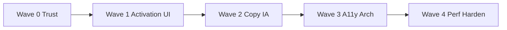

# Fellowship Focus Web — Unified Master Plan

**Date:** 2026-07-23  
**Scope:** `web/` primary; `extension/` and desktop bridge where they affect trust, blocker truth, and session integrity.  
**Sources:** 10 specialist reviews (Visual design · Content/copy · UX product · A11y · Security · Architecture · Mobile · Performance · QA · Blocker reliability).  
**Status:** Wave 0–1 shipped 2026-07-23 (+ selected deferred). Track remaining via backlog `Done?` column.

**Related (narrower, partially superseded):**

- [`BLOCK-LAYOUT-PLAN.md`](./BLOCK-LAYOUT-PLAN.md) — Block panel layout detail; Wave 1 wire-up owns shipping.
- [`UX-PLAN.md`](./UX-PLAN.md) — prior chrome/toast backlog; many items Done; open gaps fold into this plan.

---

## 1. Executive summary

Fellowship Focus already has strong brand atmosphere (heritage dark + immersive scene), a clear moat placement (Shield / Blocker Mode in chrome), and solid engineering instincts (deadline-based timer, Block keep-alive, desktop arming lifecycle). The product is not blocked by missing features so much as by **trust gaps**: public guild APIs leak member tokens, Notify/hard-mode claims diverge from extension enforcement, and the web timer can run without a live shield or with a desynced extension clock. Composition debt (unwired `session-top` layout, tall music, fixed timer digits, wrapping header) and bilingual leftovers (Stakes FR, French habit presets) undermine first-run clarity. Architecture debt (`BlockTab` god component, dual HabitTracker mounts, three prefs writers, no error boundaries/tests) makes every fix riskier. This plan sequences **trust & safety first**, then **Block activation composition**, then **product language**, then **a11y + structure**, then **performance polish**.

### Top 5 risks

| # | Risk | Why it matters |
|---|------|----------------|
| 1 | **Member tokens on public guild API** (+ Railway wildcard + `getState` token echo) | Invite-code holders impersonate any member; blocker + XP takeover |
| 2 | **UI claims ≠ enforcement** (Notify still DNR-redirects; extension hard mode missing auto-hosts; desktop Start skips arm) | Users believe they are protected when they are not |
| 3 | **Dual session clocks** (web pause/restore/log ≠ extension alarms/log) | Double XP, silent credit loss, “Paused” while extension advances |
| 4 | **Unmarked unprotected Start** + weak first-run path | Trains “timer works, blocking optional” — kills moat retention |
| 5 | **Half-shipped Block composition** (`blockLayout` / compact music / clamp digits unwired) | Broken mid-width grid, zoom pain, empty scene void — looks unfinished |

---

## 2. Glossary decision (locked)

| Term | Decision | Rationale |
|------|----------|-----------|
| **Brand** | **Fellowship Focus** (product name, landing, legal) | Keep Tolkien-heritage brand outside chrome labels |
| **In-app group** | **Guild** | Tab, create/join, ladder, Trust, feed copy → “guild”; routes/API may keep `/f/` + `fellowship` internally |
| **Moat control (chrome)** | **Shield** | Primary label in pill, toasts, blocked page, download steps; tooltip/subtitle may say “Blocker Mode” once |
| **Timed session** | **Focus session** (user-facing); “quest” only as optional flavor one-liner, never unexplained chrome | Avoid Quest/Fellowship/Guild pile-up in controls |
| **Landing create** | Prefer “Found a **guild**” (or secondary accordion) so marketing matches Guild tab | Ends dual “fellowship vs guild” found flows |

Feed strings, leave-confirm, Trust empty states, and download step copy must follow this glossary in Wave 2 (and any Wave 0/1 user-facing strings that already mention Shield/Guild).

---

## 3. Phased roadmap

### Wave 0 — Trust & safety *(this week)*

**Goals:** Stop credential leaks; make blocker claims true; make session clock integrity trustworthy.

| Theme | Outcomes |
|-------|----------|
| Security | Strip tokens from public member DTOs; narrow extension `externally_connectable`; no token in `getState`; require `AUTH_SECRET` in prod |
| Blocker truth | Notify without DNR redirect; hard-mode host parity on extension; direct-channel arm; desktop Start arms (or confirms unprotected); arming toast truth |
| Session integrity | Single session logger (web XOR extension); pause/stop sync to extension; restore re-arms or credits expired sessions |

### Wave 1 — Block composition & activation

**Goals:** First viewport reads as one composition; first-run activates the moat; Start/arm is honest.

| Theme | Outcomes |
|-------|----------|
| Layout | Wire `session-top` + compact music + `.ff-timer-digits`; demote list `min-h`; layout picker optional P1 |
| Activation | Onboarding checklist; Connect chooser (app \| extension); don’t unmarked unprotected Start |
| Chrome / mobile | Header collapse / overflow; touch targets ≥44px on primary chrome; Start above fold |

### Wave 2 — Product clarity

**Goals:** One English dialect; one glossary; less Guild cognitive load.

| Theme | Outcomes |
|-------|----------|
| Copy | EN Stakes; Anglicize habit presets; Shield/Guild everywhere user-facing |
| IA | Quest one-liner; soft Settings toasts; Trust how-to; habit dedupe framing |
| Guild | Collapse sections / progressive disclosure; one invite shell model (P1) |

### Wave 3 — A11y + architecture

**Goals:** Core AA footing; safe refactors so Waves 0–2 don’t rot.

| Theme | Outcomes |
|-------|----------|
| A11y | Settings focus trap; real tabs or demote roles; timer live region; habit ≥24px; hard-unlock UI |
| Arch | Split BlockTab; error boundaries; single HabitTracker + HabitStore; unified prefs writer; Vitest on pure libs |

### Wave 4 — Performance & polish

**Goals:** Deploy stays lean; polling/IPC stop burning CPU; P2 leftovers.

| Theme | Outcomes |
|-------|----------|
| Perf | No multi-GB audio in web deploy; throttle timer React/IPC; video `preload="metadata"`; dirty-check polls; `next/dynamic` |
| Polish | Tokens out of query strings; CORS/CSP; YouTube SPA; contrast/reduced-motion; asset cleanup |

---

## 4. Unified backlog

Legend — **Pri:** P0 / P1 / P2. **Done?** blank until shipped. **Sources** = review lenses (deduped).

| ID | Wave | Pri | Item | Sources | Files | Done? |
|----|------|-----|------|---------|-------|-------|
| W0-S1 | 0 | P0 | Strip `token` from public guild member payloads; resolve “me” via own auth header/cookie, not scanning others’ tokens | Security, QA | `lib/db.ts`, `api/fellowship/[code]/route.ts`, `FellowshipDashboard.tsx` | Done |
| W0-S2 | 0 | P0 | Narrow extension trust: exact prod host(s), not `*.up.railway.app`; validate `sender.origin` on external messages | Security | `extension/manifest.json`, `extension/background.js` | Done |
| W0-S3 | 0 | P0 | Stop returning tokens from extension `getState` / external handlers | Security | `extension/background.js` | Done |
| W0-S4 | 0 | P0 | Require `AUTH_SECRET` in production; remove `"dev-only-change-me"` fallback | Security | `auth.ts`, `api/github/activity/route.ts` | Done |
| W0-B1 | 0 | P0 | Notify mode: do **not** install DNR redirects; one penalty/stats writer (no double `/api/blocks`) | Blocker, QA | `extension/background.js`, `extension/block.js` | Done |
| W0-B2 | 0 | P0 | Hard-mode host auto-add on extension (parity with desktop `HARD_HOSTS_OPTIONAL`) **or** honest UI that stops promising Whole sites on Chrome | Blocker, Copy, UX | `extension/background.js`, `blockerSettings.ts`, `BlockTab.tsx` | Done |
| W0-B3 | 0 | P0 | Route `connectExtension` + `extensionCommand` through `sendDirect` first (fallback postMessage) | Blocker | `extensionBridge.ts`, `pair/page.tsx` | Done |
| W0-B4 | 0 | P0 | Desktop Start must arm shield (wait live) or confirm unprotected start | Blocker, UX | `BlockTab.tsx` `start()`, `desktop.ts`, `main_window.py` | Done |
| W0-B5 | 0 | P0 | Arming toast truth: never toast “OFF” while `arming`; toast Arming → Live/Fail from poll | Blocker | `BlockTab.tsx` `toggleShield`, `main_window.py` | Done |
| W0-Q1 | 0 | P0 | Single session completion logger (web XOR extension) | QA, Blocker | `BlockTab.tsx`, `extension/background.js` | Done |
| W0-Q2 | 0 | P0 | Pause / resume / stop sync to extension focus (clear/recreate alarm or pause flag) | QA, Blocker | `BlockTab.tsx`, `extensionBridge.ts`, `extension/background.js` | Done |
| W0-Q3 | 0 | P0 | Restore: re-arm + `startFocus` with remaining ms; expired → credit/advance or prompt (no silent discard) | QA, Blocker | `BlockTab.tsx` restore effect, extension `startFocus` | Done |
| W1-D1 | 1 | P0 | Wire `session-top` layout: `ff-block-layout` + `areaForPanel`; hydrate/persist `blockLayout` | Design, Mobile, UX | `BlockTab.tsx`, `globals.css`, `lib/blockLayout.ts` | Done |
| W1-D2 | 1 | P0 | Pass `compact={musicCompactFor(layoutId)}` to `FocusMusicPanel` | Design, Mobile | `BlockTab.tsx`, `FocusMusicPanel.tsx` | Done |
| W1-D3 | 1 | P0 | Apply `.ff-timer-digits` (clamp); drop fixed `text-[3.25rem]` | Design, Mobile | `BlockTab.tsx`, `globals.css` | Done |
| W1-D4 | 1 | P0 | Chip floor `text-xs` / min-h; demote Block list `min-h-[22rem]` | Design, Mobile | `BlockTab.tsx` | Done |
| W1-M1 | 1 | P0 | Collapse header on small widths (tabs + Shield + overflow for auth/Share/Leave/Settings) | Mobile, Design, UX | `FocusApp.tsx`, `BlockerMode.tsx` | Done |
| W1-M2 | 1 | P0 | Raise primary touch targets (~44px) on chips/steppers/settings/float/toast dismiss; habit cells ≥36px on narrow | Mobile, A11y | `BlockTab.tsx`, `FocusApp.tsx`, `HabitTracker.tsx`, `Toasts.tsx` | Done |
| W1-U1 | 1 | P0 | First-run activation checklist (connect → preset → Shield ON → Start); persist `ff-onboarded` | UX | `FocusApp.tsx`, `BlockTab.tsx`, new `OnboardingCard.tsx` | Done |
| W1-U2 | 1 | P0 | Disconnected pill CTA = **Connect** chooser (Windows app \| Chrome extension) | UX, Copy | `BlockerMode.tsx`, `/download`, `/extension` | Done |
| W1-U3 | 1 | P0 | Don’t unmarked unprotected Start — modal Connect vs Start without blocking | UX, Blocker | `BlockTab.tsx` `start()` | Done |
| W1-D5 | 1 | P1 | Layout menu (session-top / side / classic-3 / swap / reset) | Design | `BlockTab.tsx`, optionally `SettingsPanel.tsx` | Done |
| W1-M3 | 1 | P1 | z-index + corner stacking (settings ≥ float; toast offset; safe-area) | Mobile | `SettingsPanel.tsx`, `BlockTab.tsx`, `Toasts.tsx` | |
| W2-C1 | 2 | P0 | Translate entire `StakesPanel` to English; no `.env` dump in UI | Copy, UX | `StakesPanel.tsx` | Done |
| W2-C2 | 2 | P0 | Anglicize habit preset labels (stable IDs) | Copy | `habits.ts`, `HabitTracker.tsx` | Done |
| W2-C3 | 2 | P0 | Apply glossary: Guild in-app; feed/landing “guild”; API internal names OK | Copy, UX | `page.tsx`, `FocusApp.tsx`, `GuildDirectory.tsx`, `FellowshipDashboard.tsx`, `db.ts` | |
| W2-C4 | 2 | P0 | Chrome + toasts + download + blocked = **Shield** (Blocker Mode as tooltip only) | Copy, UX | `BlockerMode.tsx`, `BlockTab.tsx`, `download/page.tsx`, `blocked/page.tsx` | Done |
| W2-C5 | 2 | P1 | Focus-quest one-liner under idle Start; align download steps with Connect/Shield | Copy, UX | `BlockTab.tsx`, `download/page.tsx` | |
| W2-C6 | 2 | P1 | Soften Settings/scan/import toasts with next step; Trust empty how-to; hard-mode microcopy | Copy | `SettingsPanel.tsx`, `BlockerControls.tsx`, `TrustPanel.tsx` | |
| W2-U4 | 2 | P1 | Habit surface: Focus owns grid; Guild = shared summary + link **or** single owner (aligns Arch) | Copy, UX, Arch | `FocusTab.tsx`, `FellowshipDashboard.tsx` | |
| W2-U5 | 2 | P1 | Collapse Guild dashboard into sections; one invite URL + chrome shell | UX | `FellowshipDashboard.tsx`, `f/[code]/page.tsx`, `FocusApp.tsx` | |
| W2-C7 | 2 | P2 | Seed grammar, leave-confirm name, overlay “ambient”, euro OKR soften, Prospection→Outreach | Copy | `db.ts`, `FocusApp.tsx`, `FocusOverlay.tsx`, `FocusTab.tsx`, `activities.ts` | |
| W3-A1 | 3 | P0 | Settings dialog: initial focus, Tab trap, restore focus on close | A11y | `SettingsPanel.tsx`, `FocusApp.tsx` | |
| W3-A2 | 3 | P0 | Finish ARIA tabs **or** demote to plain nav (no fake `tablist`) | A11y | `FocusApp.tsx` | |
| W3-A3 | 3 | P0 | Timer session `aria-live` polite (phases only, not per-second) | A11y | `BlockTab.tsx` | |
| W3-A4 | 3 | P0 | Habit day targets ≥24×24 CSS px | A11y, Mobile | `HabitTracker.tsx` | |
| W3-A5 | 3 | P0 | In-app hard-unlock UI (countdown, Cancel, live status) vs silent `confirm`/`prompt` | A11y, UX | `BlockerControls.tsx`, `HardUnlockModal.tsx` | |
| W3-R1 | 3 | P0 | Split `BlockTab` → hooks + panels (`useFocusTimer`, `useBlocklist`, `useShieldController`, `useBlockerPrefs`) | Arch | `components/BlockTab.tsx` → `components/block/*`, `hooks/*` | |
| W3-R2 | 3 | P0 | React error boundary + `app/error.tsx` / `app/app/error.tsx` | Arch | `ErrorBoundary.tsx`, `FocusApp.tsx`, `app/` | Done |
| W3-R3 | 3 | P0 | Single HabitTracker owner + `HabitStore` (Api/Solo/Composite); surface mutation errors | Arch, QA, UX | `HabitTracker.tsx`, `soloHabits.ts`, `FocusApp.tsx`, callers | |
| W3-R4 | 3 | P0 | Unified prefs writer (`saveBlockerPrefs`) including `desktopBridge.setPrefs` | Arch | `blockerSettings.ts` / `prefsStore.ts`, `BlockTab.tsx`, `SettingsPanel.tsx` | |
| W3-A6 | 3 | P1 | Labels on text fields; `aria-pressed` on segmented controls; contrast + reduced-motion pass | A11y | Block/Guild/Focus/Settings, `globals.css` | |
| W3-R5 | 3 | P1 | `MembershipProvider`; typed desktop bridge; Vitest on merge/session/habits | Arch | `FocusApp.tsx`, `desktop.ts`, `package.json` | |
| W3-R6 | 3 | P2 | Feature folders; keep-mount Focus or habit cache; delete/rewire `FocusOverlay` | Arch | `components/*`, `FocusOverlay.tsx` | |
| W4-P1 | 4 | P0 | Keep web deploy free of multi-GB `public/audio/*.mp3`; CI size guard; desktop-only music | Perf | `public/audio/`, deploy/`railpack`, `FocusMusicPanel.tsx` | Done |
| W4-P2 | 4 | P0 | Throttle timer React updates (ref/rAF; skip when `document.hidden`) | Perf | `BlockTab.tsx` | |
| W4-P3 | 4 | P0 | Dirty-check / throttle `showFloatTimer` IPC | Perf | `BlockTab.tsx`, `desktop.ts` | |
| W4-P4 | 4 | P0 | Immersive video `preload="metadata"`; lighter scene transitions | Perf | `ImmersiveScene.tsx`, `scenes.ts` | Done |
| W4-P5 | 4 | P1 | Dirty-check desktop/music polls; pause intervals when Block hidden; Guild poll 30–60s + visibility | Perf | `BlockTab.tsx`, `FocusMusicPanel.tsx`, `FellowshipDashboard.tsx` | |
| W4-P6 | 4 | P1 | `next/dynamic` for Focus/Guild/Settings; extension poll backoff | Perf | `FocusApp.tsx`, `extensionBridge.ts` | |
| W4-S5 | 4 | P1 | Tokens out of query strings → Bearer only; tighten CORS; CSP/frame-ancestors; origin-check `postMessage` | Security | API routes, `extension/background.js`, `extensionBridge.ts`, `next.config.ts` | |
| W4-B6 | 4 | P1 | YouTube SPA `onHistoryStateUpdated`; soft/hard shared matrix; desktop Notify implement or hide | Blocker | `extension/background.js`, `blockerSettings.ts`, desktop blocker | |
| W4-Q4 | 4 | P1 | Clear `ff-google-user` when unauthenticated; Start in-flight lock; local calendar dates; offline session outbox | QA | `FocusApp.tsx`, `BlockTab.tsx`, `soloStats.ts`, `soloHabits.ts` | |
| W4-P7 | 4 | P2 | Compress/delete unused stills; `next/image`; SessionProvider refetch tune; music stop-once | Perf, QA | `public/`, `Providers.tsx`, `FocusMusicPanel.tsx` | |

---

## 5. Deduplication notes

| Overlap | Unified as |
|---------|------------|
| Security + QA token leak on guild API | **W0-S1** |
| Security extension Railway wildcard + external messages | **W0-S2** (+ W0-S3 getState) |
| Design + Mobile + UX unwired `blockLayout` / compact music / clamp digits | **W1-D1–D3** |
| Design + Mobile header wrap / touch | **W1-M1–M2** |
| Copy + UX Shield vs Blocker Mode + Guild vs Fellowship | Glossary §2 + **W2-C3–C4** |
| UX + Blocker unprotected Start / arm | **W0-B4**, **W1-U3** |
| QA + Blocker dual clock / pause / double log | **W0-Q1–Q3**, **W0-B1** (double blocks) |
| Arch + UX + Copy HabitTracker twice | **W2-U4** (product) + **W3-R3** (implementation) |
| A11y + Mobile habit targets | **W3-A4** (24px AA) / **W1-M2** (touch 36–44 on narrow) — implement once, satisfy both |
| Perf audio “don’t ship” vs Music panel empty CTA | **W4-P1** |

---

## 6. Out of scope / still deferred

- Full freeform panel drag / `react-grid-layout` — **named layouts + timer/music swap shipped**; pixel masonry still out.
- Full Focus / Guild visual redesign (beyond token hygiene + density trim).
- Firefox / Edge blocker *engines* — honesty doc in [`BROWSER-HONESTY.md`](./BROWSER-HONESTY.md); no new engines.
- Merging personal ladder (hours) vs guild XP into one currency — **legend copy shipped**; currencies stay separate.
- Shipping large MP3s to the web CDN — **still rejected** (`npm run check:audio`).
- Rewriting mitm/proxy/cert architecture — still out (copy/empty-state only).
- Soft captcha provider (Turnstile/hCaptcha) — IP rate limits shipped instead.
- Full `BlockTab` split (W3-R1) — deferred to avoid blocking ship.

**Now shipped from former deferred:** token hash+vault at rest + rotate/revoke API; create/join + session rate limits; session minute caps; browser honesty doc; ladder hours-vs-XP legend.

---

## 7. Acceptance checklists

### Wave 0 — Trust & safety

- [ ] Anonymous `GET /api/fellowship/{code}` JSON has **no** `token` fields; dashboard still identifies current member.
- [ ] Extension `externally_connectable` / content matches are exact prod (+ localhost dev); third-party Railway origin cannot `getState` with token.
- [ ] Extension `getState` (and external equivalents) omit long-lived member token.
- [ ] Production boot fails without `AUTH_SECRET` / `NEXTAUTH_SECRET`.
- [ ] Hit style **Notify**: navigation does not land on full block page via DNR; at most one block report / XP path per hit.
- [ ] Extension hard / Whole sites matches desktop auto-hosts **or** UI no longer claims that on Chrome.
- [ ] Arm/connect works when content script late/missing (direct channel).
- [ ] Desktop: Start with cert ready ends with shield live (or explicit unprotected confirm).
- [ ] Toggle Shield ON never flashes “Shield OFF” toast while arming.
- [ ] One focus completion → one `POST /api/sessions` (web XOR extension).
- [ ] Pause freezes extension focus alarm; Stop clears it.
- [ ] Reload mid-session keeps protection + remaining time; reload after expiry credits or prompts (not silent idle).

### Wave 1 — Block composition & activation

- [ ] Desktop 100%: session row (timer \| compact music) + full-width block list; no empty panel-sized void.
- [ ] Zoom 80% / 125%: digits clamp; chips readable; header ≤2 lines or overflow menu.
- [ ] Mid-width (~1024–1279): no orphan Music-only column void.
- [ ] First-run checklist visible until `ff-onboarded`; Connect chooser offers app **and** extension.
- [ ] Start without engine opens Connect vs unprotected modal (default emphasize Connect).
- [ ] Phone ~390px: Start reachable without hunting under multi-row chrome; primary controls tappable.

---

## 8. Suggested ownership order (execution)

Within Wave 0: **W0-S1 → W0-S2/S3 → W0-B1 → W0-B3 → W0-B2 → W0-B4/B5 → W0-Q1–Q3 → W0-S4**.

---

*End of master plan. Update `Done?` as items ship; keep glossary §2 stable unless product explicitly revisits.*
